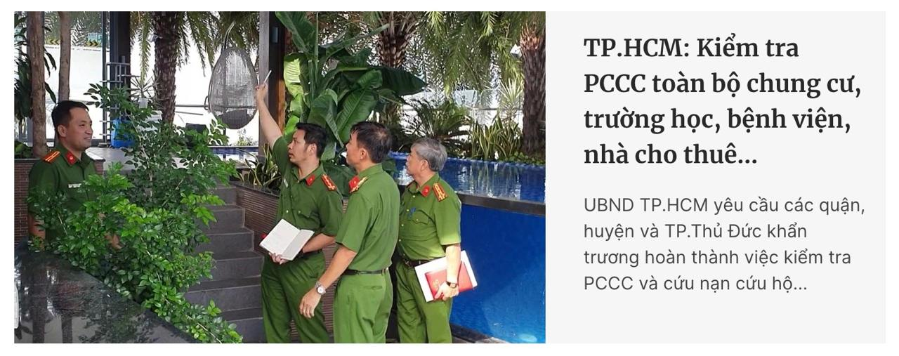
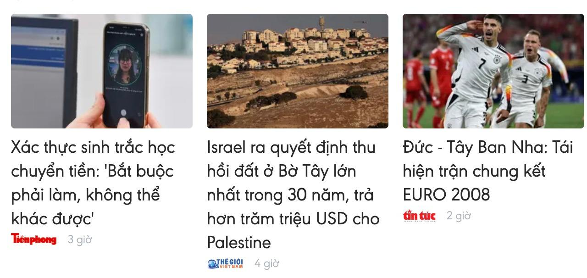
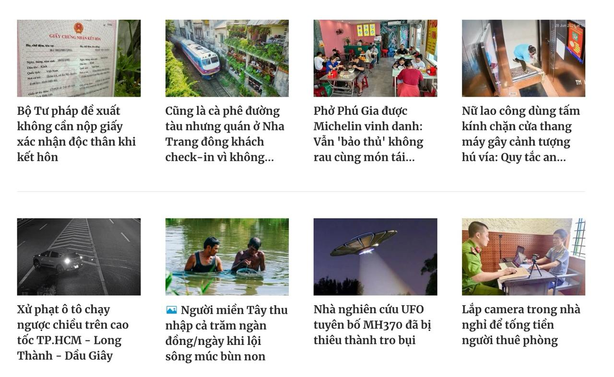
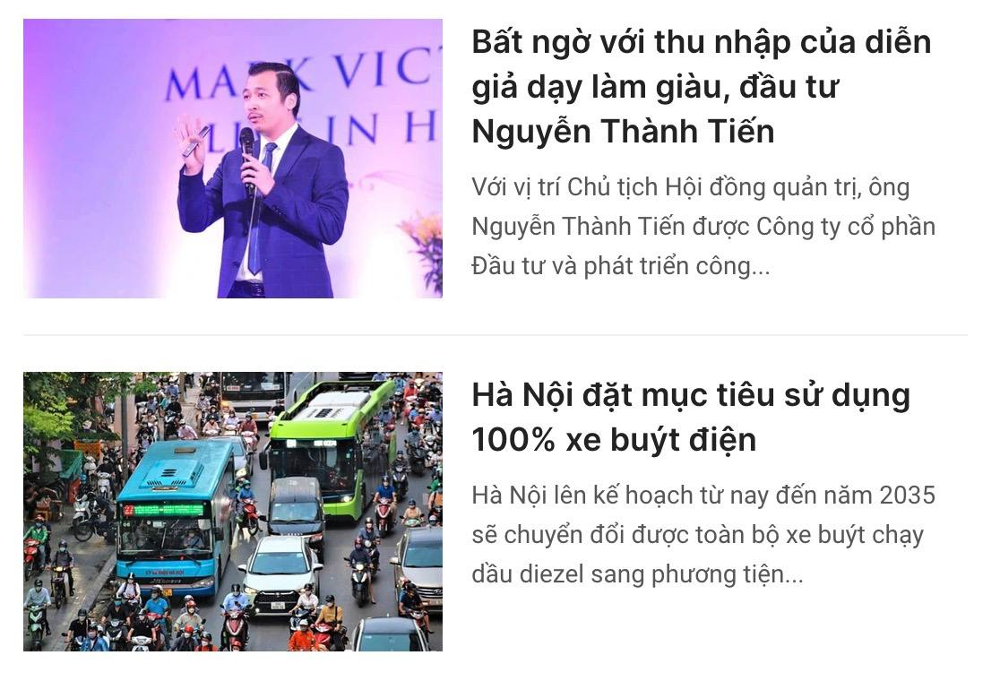
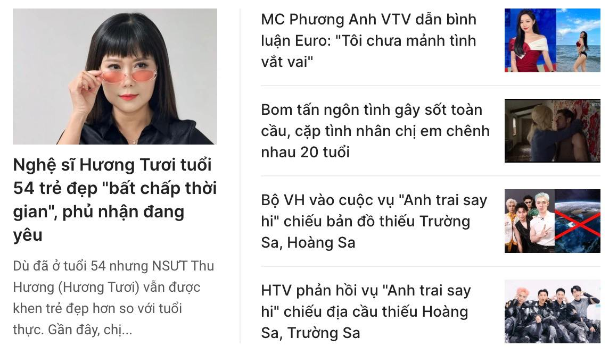
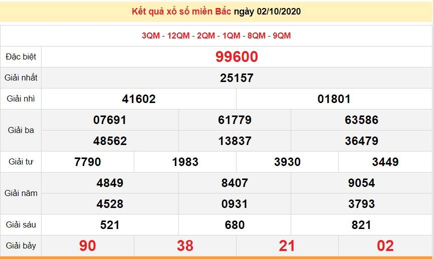
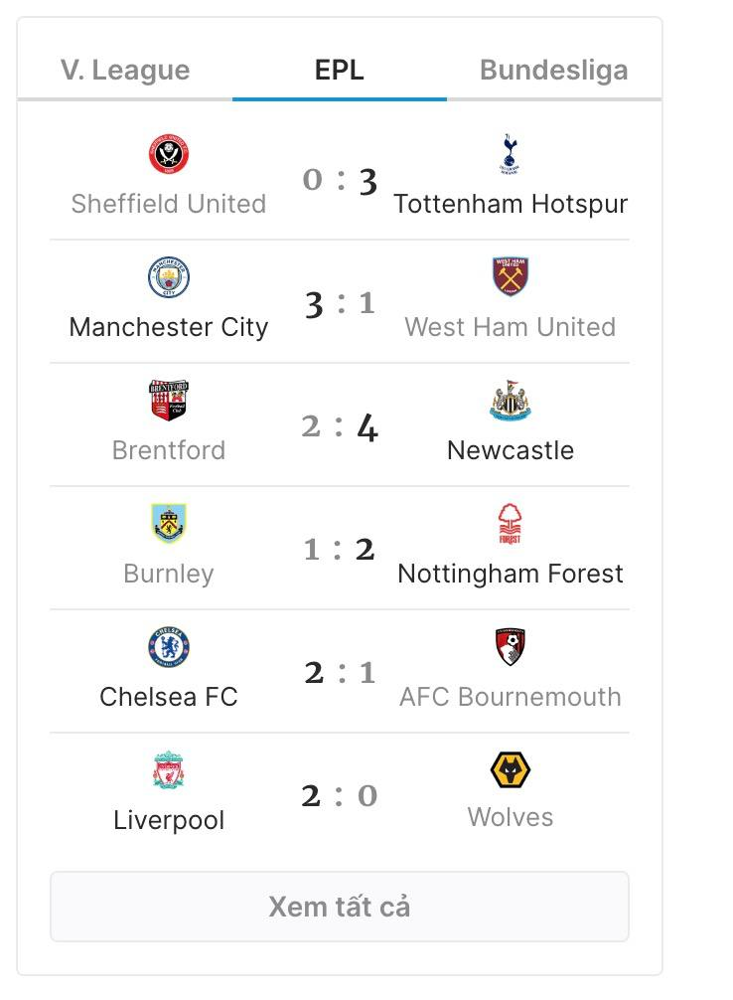
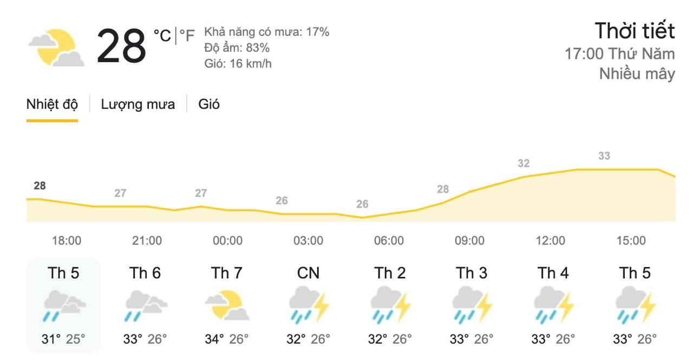

# f_news

In this project, we will create a fnews website. The website will have a logo, a search bar, and a list of news articles. The news articles will be displayed in a card format. Each card will have a title, a description, and a link to the full article.

The project will be built using HTML, CSS only. The project will be responsive and will look good on all devices.

The project will be built using the following components:

- Logo
- Search bar
- Profile icon
- Nav
- Expand nav
- spotlight
- brief
- word-run
- world cloud
- trending
- list-news-column
- list-news-block
- utility-lottery
- utility-football
- utility-weather
- short-video
- footer-summary
- footer-link
- footer-contact
- subscribe mail
- social media
- copy right

Color palette:

- Primary color: #f44336

## Task

1. **Logo**

- Find a logo for the project. Place it in the `assets` folder and link it in the logo component.
- The logo can be different depending on the window size and current theme
- Beside logo show geometric and current weather

2. **Search bar**

- Create a search bar that allows the user to search for news articles
- The search bar should have placeholder text "Search for news ..."
- When typing, show display a list of result
- In the end of the search bar, there should be a search button with a magnifying glass icon

3. **Profile icon**

- Find a svg icon for the profile icon. Place it in the `assets` folder and link it in the profile icon component.
- The first time, it should a login button - Login with google. When the user clicks on it, it should change to a profile icon with the user's name

4. **Nav**

- Create a nav bar with the following links: Home, World, Politics, Business, Tech, Science, Health, Sports, Arts, Travel, Style, Food, Opinion, Weather, Magazine, Video, Audio, Coupons
- The nav bar should be responsive and display in one row
- When the window is too small, the nav bar should collapse into a hamburger menu

5. **Expand nav**

- Create a nav bar that expands when the user clicks on the hamburger menu
- The nav bar should have the same links as the nav bar

6. **Spotlight**

- Create a spotlight section that displays the most important news article
- The spotlight section should have a title, a description, and a link to the full article

7. **Brief**

- Create a brief section that displays a list of news articles
- Each news article should have a title, a description, and a link to the full article

8. **Word-run**

- Create a word-run section that displays a list of news articles it will run from right to left
- Some time it change style display (example from opacity 0 to 1)

9. **World cloud**

- Create a world cloud section that displays a list of news articles in a cloud format

10. **Trending**

- Create a trending section that displays a list of trending news articles

11. **List-news-column**

- Create a list-news-column section that displays a list of news articles in a column format

12. **List-news-block**

- Create a list-news-block section that displays a list of news articles in a block format

13. **Utility-lottery**

- Create a utility-lottery section that displays a list of lottery news articles

14. **Utility-football**

- Create a utility-football section that displays a list of football news articles

15. **Utility-weather**

- Create a utility-weather section that displays the current weather

16. **Short-video**

- Create a short-video section that displays a list of short videos

17. **Footer-summary**

- Create a footer-summary section that displays a summary of the website

18. **Footer-link**

- Create a footer-link section that displays a list of links
- The links should be displayed in a column format as value as nav bar

19. **Footer-contact**

- Create a footer-contact section that displays a contact form
- It should have a name, email, and message field
- It should have icon for each field

20. **Subscribe mail**

- Create a subscribe mail section that allows the user to subscribe to the website
- It should have an email field and a subscribe button

21. **Social media**

- Create a social media section that displays a list of social media icons
- The social media icons should be displayed in a column format

22. **Copy right**
- Anh Linh da lam
- Create a copy right section that displays the copy right information and other legal information
